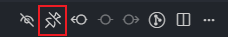

# Batch Unpin Tabs

<div align="center">

[English](README_EN.md) | [中文](README.md)

</div>

## Description

This VSCode extension provides the functionality to batch unpin all pinned tabs in the current window. When you have multiple pinned tabs, you can unpin all pinned tabs in the current active window with one click, without having to manually unpin them one by one. It's particularly useful for scenarios where you want to unpin tabs only in the current window after splitting the editor.

## Features

- 🚀 One-click batch unpin of all pinned tabs in the current window
- 🎯 Intelligently identifies the current active window, only operates on tabs in the current window
- ⚡ Unpins from back to front to avoid tab flickering and shifting
- ⚠️ Shows confirmation dialog before operation to prevent accidental actions
- 📊 Displays operation results and statistics
- 📝 Accessible through command palette and editor title bar
- 🌍 Multi-language interface support (English/Chinese)

## Usage

### Method 1: Command Palette

1. Press `Ctrl+Shift+P` (Windows/Linux) or `Cmd+Shift+P` (Mac) to open the command palette
2. Type "Unpin Pinned Tabs in Current Window" or "Batch Unpin"
3. Select the command and execute

### Method 2: Editor Title Bar

Find the "Unpin Pinned Tabs in Current Window" button in the navigation group of the editor title bar



## Installation

### From VSCode Extension Marketplace

1. Open VSCode
2. Press `Ctrl+Shift+X` to open the extensions panel
3. Search for "Batch Unpin Tabs"
4. Click install

### Development Environment Installation

1. Clone or download this project
2. Run in the project root directory:
   ```bash
   npm install
   npm run compile
   ```
3. Press `F5` to start debug mode, which will open a new VSCode window
4. Test the extension functionality in the new window

### Manual Installation

1. Install the `vsce` tool:
   ```bash
   npm install -g vsce
   ```
2. Run in the project root directory:
   ```bash
   vsce package
   ```
3. The generated `.vsix` file can be installed in VSCode through the "Extensions" panel

## Development

### Project Structure

```
batch-unpin/
├── src/
│   ├── extension.ts      # Main extension logic
│   └── i18n.ts          # Internationalization support
├── i18n/
│   ├── zh-cn.json       # Chinese language pack
│   └── en.json          # English language pack
├── package.nls.json      # VSCode UI internationalization (Chinese)
├── package.nls.en.json   # VSCode UI internationalization (English)
├── package.json          # Extension configuration
├── tsconfig.json         # TypeScript configuration
└── README_EN.md         # Documentation
```

### Main Functionality Implementation

- Uses `vscode.window.tabGroups.all` to get all tab groups
- Gets all tabs through `flatMap`
- Uses `filter` to screen out pinned tabs
- Unpins through `vscode.commands.executeCommand('workbench.action.unpinEditor')`
- Multi-language interface support with automatic language detection

### Internationalization Features

- **VSCode UI Internationalization**: Command titles, tooltips, and other UI elements support English and Chinese
- **Runtime Internationalization**: All messages during operation support multiple languages
- **Automatic Language Detection**: Automatically selects the appropriate language based on user's VSCode language settings
- **Parameterized Messages**: Supports dynamic parameter replacement, such as tab counts

## Notes

- The extension shows a confirmation dialog to prevent accidental operations
- If there are no pinned tabs currently, it will display a prompt message
- After the operation is completed, it will show the number of successfully unpinned tabs
- Interface language automatically switches based on VSCode settings

## License

MIT License
